# kg-mcp — system diagrams

**Doc version:** 1.3 · **Date:** 2026-09-06 · **Companion to:** spec v0.8.0, plan 1.7
**Format:** Mermaid (renders in GitHub, Obsidian, most IDEs). Tags: `[v1]` built now · `[gated]` plumbing in v1, rule behind a flag · `[post-v1]` deferred behind seams.

---

## 1. System context `[v1]`

Core contains no parser and no language-specific code. Every source of knowledge — human, agent, or emitter — writes claims through one ingest port.

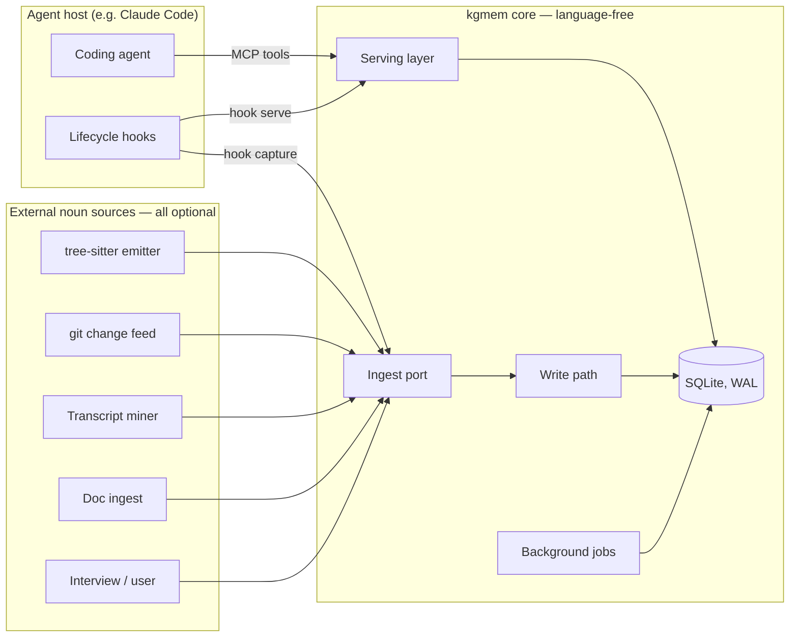
```mermaid
flowchart LR
  subgraph host["Agent host (e.g. Claude Code)"]
    A["Coding agent"]
    H["Lifecycle hooks"]
  end
  subgraph core["kgmem core — language-free"]
    S["Serving layer"]
    I["Ingest port"]
    W["Write path"]
    J["Background jobs"]
    DB[("SQLite, WAL")]
  end
  subgraph src["External noun sources — all optional"]
    P["tree-sitter emitter"]
    G["git change feed"]
    T["Transcript miner"]
    D["Doc ingest"]
    U["Interview / user"]
  end
  A -->|MCP tools| S
  H -->|hook serve| S
  H -->|hook capture| I
  P --> I
  G --> I
  T --> I
  D --> I
  U --> I
  I --> W
  S --> DB
  W --> DB
  J --> DB
```

## 2. Process model `[v1]`

No daemon in v1. Every process is a thin adapter over the same library, sharing one WAL-mode SQLite file.

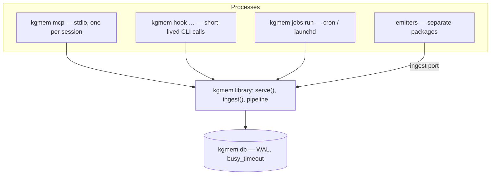
```mermaid
flowchart TB
  subgraph procs["Processes"]
    M["kgmem mcp — stdio, one per session"]
    C["kgmem hook … — short-lived CLI calls"]
    K["kgmem jobs run — cron / launchd"]
    E["emitters — separate packages"]
  end
  L["kgmem library: serve(), ingest(), pipeline"]
  F[("kgmem.db — WAL, busy_timeout")]
  M --> L
  C --> L
  K --> L
  E -->|ingest port| L
  L --> F
```

## 3. Core module map `[v1]`

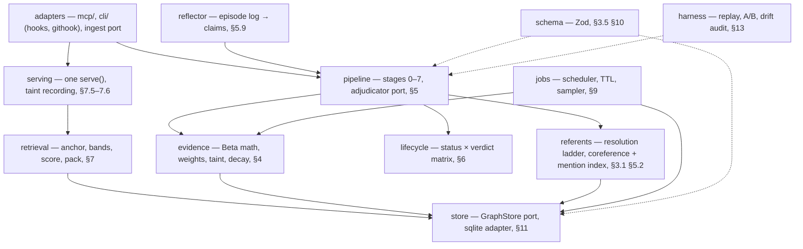
```mermaid
flowchart TB
  schema["schema — Zod, §3.5 §10"]
  store["store — GraphStore port, sqlite adapter, §11"]
  evidence["evidence — Beta math, weights, taint, decay, §4"]
  referents["referents — resolution ladder, coreference + mention index, §3.1 §5.2"]
  pipeline["pipeline — stages 0–7, adjudicator port, §5"]
  lifecycle["lifecycle — status × verdict matrix, §6"]
  retrieval["retrieval — anchor, bands, score, pack, §7"]
  serving["serving — one serve(), taint recording, §7.5–7.6"]
  adapters["adapters — mcp/, cli/ (hooks, githook), ingest port"]
  jobs["jobs — scheduler, TTL, sampler, §9"]
  reflector["reflector — episode log → claims, §5.9"]
  harness["harness — replay, A/B, drift audit, §13"]
  adapters --> serving --> retrieval --> store
  adapters --> pipeline --> lifecycle
  pipeline --> evidence --> store
  pipeline --> referents --> store
  reflector --> pipeline
  jobs --> evidence
  jobs --> store
  schema -.-> store
  schema -.-> pipeline
  harness -.-> pipeline
```

## 4. Data model — ledger and views `[v1]`

Claims are the only primitive. Everything on the right is a **materialized view**, rebuildable from the ledger. No foreign keys point from the ledger onto views.

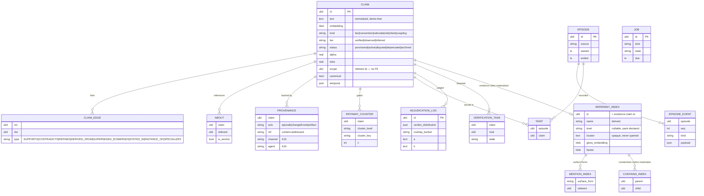
```mermaid
erDiagram
  CLAIM {
    ulid id PK
    text text "normalized, deixis-free"
    blob embedding
    string kind "fact|convention|rationale|risk|intent|coupling"
    string tier "verified|observed|inferred"
    string status "provisional|active|disputed|deprecated|archived"
    real alpha
    real beta
    ulid scope "referent id — no FK"
    bool canonical
    json temporal
  }
  CLAIM_EDGE {
    ulid src
    ulid dst
    string type "SUPPORTS|CONTRADICTS|REFINES|DERIVED_FROM|SUPERSEDED_BY|MERGES|STATED_IN|INSTANCE_OF|SPECIALIZES"
  }
  ABOUT {
    ulid claim
    ulid referent
    bool is_anchor
  }
  PROVENANCE {
    ulid claim
    string axis "episode|changeEvent|artifact"
    string ref "content-addressed"
    string channel "A15"
    string agent "A15"
  }
  PATHWAY_COUNTER {
    ulid claim
    string cluster_level
    string cluster_key
    int n
  }
  EPISODE {
    ulid id PK
    string source
    ts started
    ts ended
  }
  EPISODE_EVENT {
    ulid episode
    int seq
    string kind
    json payload
  }
  TAINT {
    ulid episode
    ulid claim
  }
  ADJUDICATION_LOG {
    ulid id PK
    json verdict_distribution
    string overlap_bucket
    text a
    text b
  }
  VERIFICATION_TASK {
    ulid claim
    ulid rival
    string state
  }
  JOB {
    ulid id PK
    string kind
    string state
    ts due
  }
  REFERENT_INDEX {
    ulid id "= existence claim id"
    string name "derived"
    string level "nullable, pack-declared"
    text locator "opaque, never queried"
    blob gloss_embedding
    blob facets
  }
  MENTION_INDEX {
    string surface_form
    ulid referent
  }
  CONTAINS_INDEX {
    ulid parent
    ulid child
  }
  CLAIM ||--o{ CLAIM_EDGE : "links"
  CLAIM ||--o{ ABOUT : "references"
  CLAIM ||--o{ PROVENANCE : "backed by"
  CLAIM ||--o{ PATHWAY_COUNTER : "gated"
  CLAIM ||--o{ TAINT : "served in"
  CLAIM ||--o{ ADJUDICATION_LOG : "judged"
  CLAIM ||--o{ VERIFICATION_TASK : "disputed"
  EPISODE ||--o{ EPISODE_EVENT : "logs"
  EPISODE ||--o{ TAINT : "recorded"
  CLAIM ||--o| REFERENT_INDEX : "existence claim materializes"
  REFERENT_INDEX ||--o{ MENTION_INDEX : "surface forms"
  REFERENT_INDEX ||--o{ CONTAINS_INDEX : "containment claims materialize"
```

## 5. Claim anatomy `[v1]`

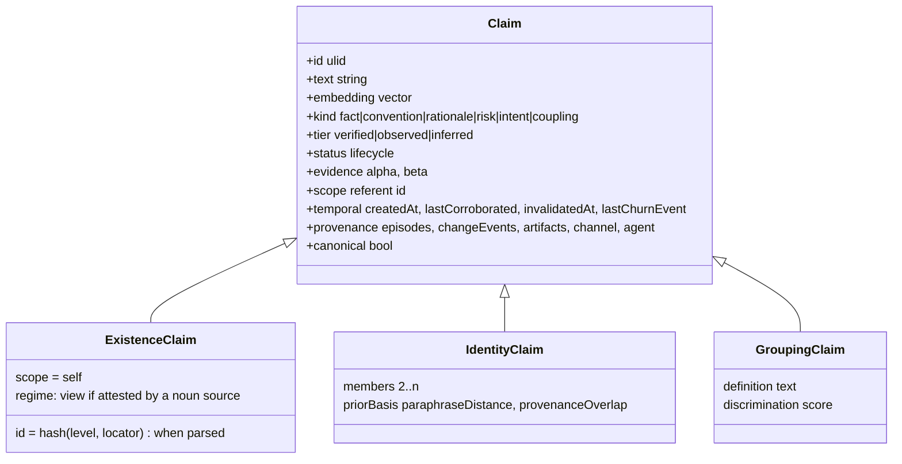
```mermaid
classDiagram
  class Claim {
    +id ulid
    +text string
    +embedding vector
    +kind fact|convention|rationale|risk|intent|coupling
    +tier verified|observed|inferred
    +status lifecycle
    +evidence alpha, beta
    +scope referent id
    +temporal createdAt, lastCorroborated, invalidatedAt, lastChurnEvent
    +provenance episodes, changeEvents, artifacts, channel, agent
    +canonical bool
  }
  class ExistenceClaim {
    scope = self
    id = hash(level, locator) when parsed
    regime: view if attested by a noun source
  }
  class IdentityClaim {
    members 2..n
    priorBasis paraphraseDistance, provenanceOverlap
  }
  class GroupingClaim {
    definition text
    discrimination score
  }
  Claim <|-- ExistenceClaim
  Claim <|-- IdentityClaim
  Claim <|-- GroupingClaim
```

## 6. One substrate, two regimes `[v1]`

Same node type; two truth-maintenance regimes. Nothing is ever both.

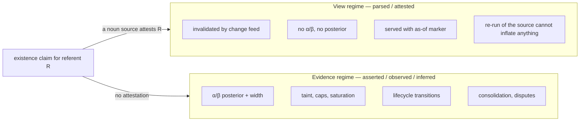
```mermaid
flowchart LR
  subgraph view["View regime — parsed / attested"]
    V1["invalidated by change feed"]
    V2["no α/β, no posterior"]
    V3["served with as-of marker"]
    V4["re-run of the source cannot inflate anything"]
  end
  subgraph bayes["Evidence regime — asserted / observed / inferred"]
    B1["α/β posterior + width"]
    B2["taint, caps, saturation"]
    B3["lifecycle transitions"]
    B4["consolidation, disputes"]
  end
  X["existence claim for referent R"] -->|a noun source attests R| view
  X -->|no attestation| bayes
```

## 7. Referent derivation — nouns to index `[v1]`

No entity is ever created directly. Naming is what creates them, in the same transaction as the claim.

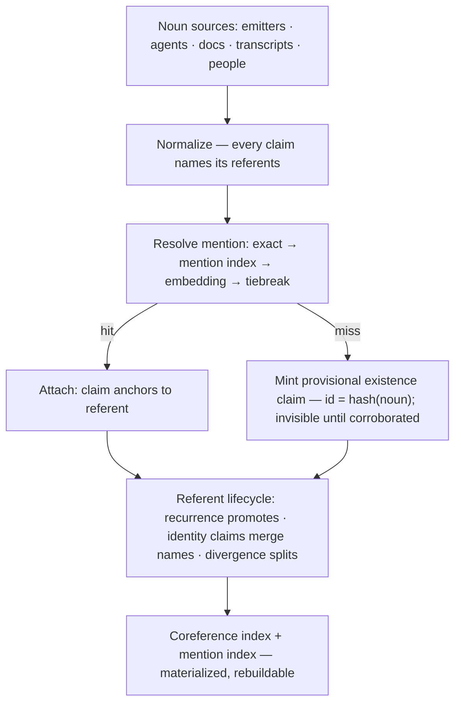
```mermaid
flowchart TD
  N["Noun sources: emitters · agents · docs · transcripts · people"] --> Z["Normalize — every claim names its referents"]
  Z --> R["Resolve mention: exact → mention index → embedding → tiebreak"]
  R -->|hit| H["Attach: claim anchors to referent"]
  R -->|miss| M["Mint provisional existence claim — id = hash(noun); invisible until corroborated"]
  H --> L["Referent lifecycle: recurrence promotes · identity claims merge names · divergence splits"]
  M --> L
  L --> IDX["Coreference index + mention index — materialized, rebuildable"]
```

## 8. Write path `[v1]`

One synchronous pipeline for every observation, whatever its source. Inline cost: one embedding + one small-model call.

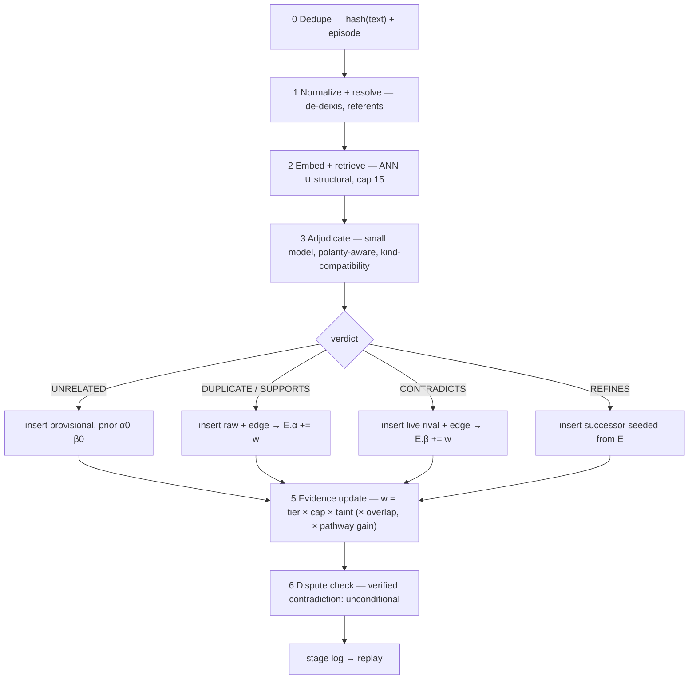
```mermaid
flowchart TD
  S0["0 Dedupe — hash(text) + episode"] --> S1["1 Normalize + resolve — de-deixis, referents"]
  S1 --> S2["2 Embed + retrieve — ANN ∪ structural, cap 15"]
  S2 --> S3["3 Adjudicate — small model, polarity-aware, kind-compatibility"]
  S3 --> S4{"verdict"}
  S4 -->|UNRELATED| I1["insert provisional, prior α0 β0"]
  S4 -->|DUPLICATE / SUPPORTS| I2["insert raw + edge → E.α += w"]
  S4 -->|CONTRADICTS| I3["insert live rival + edge → E.β += w"]
  S4 -->|REFINES| I4["insert successor seeded from E"]
  I1 --> S5["5 Evidence update — w = tier × cap × taint (× overlap, × pathway gain)"]
  I2 --> S5
  I3 --> S5
  I4 --> S5
  S5 --> S6["6 Dispute check — verified contradiction: unconditional"]
  S6 --> LOG["stage log → replay"]
```

## 9. Verdict effects `[v1]`

| Verdict | Mutation | Evidence |
|---|---|---|
| UNRELATED | insert provisional | α₀=1, β₀=1 (inferred: β₀=2) |
| DUPLICATE | raw + `DERIVED_FROM` → E | E.α += w |
| SUPPORTS | raw + `SUPPORTS` → E | E.α += w |
| CONTRADICTS | raw as live rival, `CONTRADICTS` ↔ E | E.β += w → dispute check → neighbour decay if verified |
| REFINES | successor + `REFINES` → E | successor prior seeded from E; E flagged |

## 10. Evidence weight `[v1 + gated]`

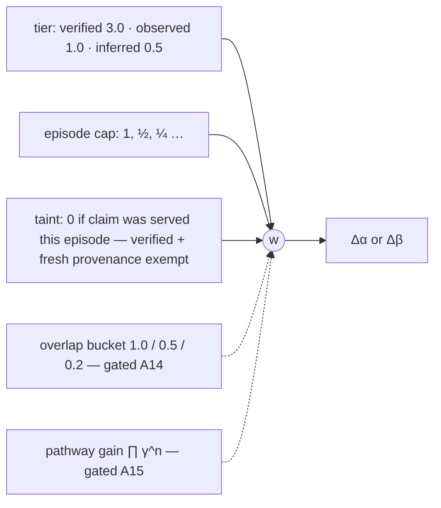
```mermaid
flowchart LR
  T["tier: verified 3.0 · observed 1.0 · inferred 0.5"] --> W(("w"))
  C["episode cap: 1, ½, ¼ …"] --> W
  X["taint: 0 if claim was served this episode — verified + fresh provenance exempt"] --> W
  O["overlap bucket 1.0 / 0.5 / 0.2 — gated A14"] -.-> W
  P["pathway gain ∏ γ^n — gated A15"] -.-> W
  W --> A["Δα or Δβ"]
```

## 11. Claim lifecycle `[v1]`

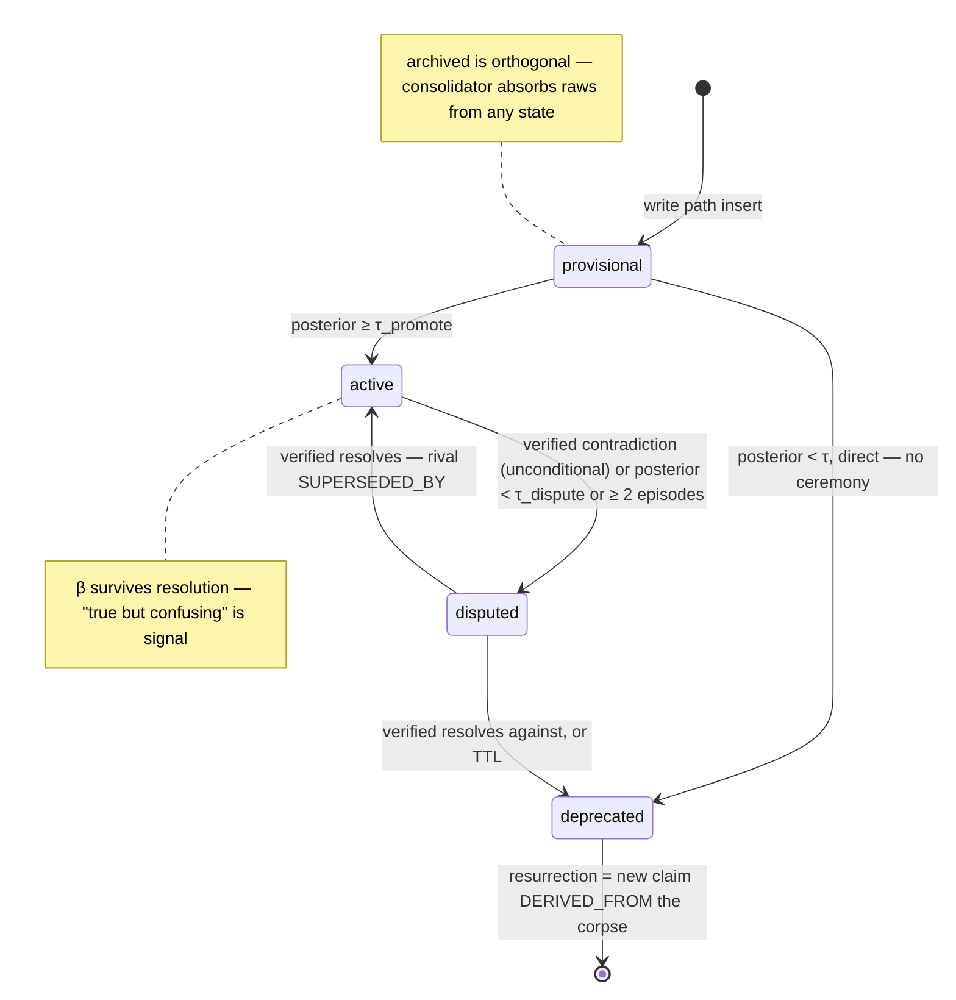
```mermaid
stateDiagram-v2
  [*] --> provisional : write path insert
  provisional --> active : posterior ≥ τ_promote
  provisional --> deprecated : posterior < τ, direct — no ceremony
  active --> disputed : verified contradiction (unconditional) or posterior < τ_dispute or ≥ 2 episodes
  disputed --> active : verified resolves — rival SUPERSEDED_BY
  disputed --> deprecated : verified resolves against, or TTL
  deprecated --> [*] : resurrection = new claim DERIVED_FROM the corpse
  note right of active : β survives resolution — "true but confusing" is signal
  note left of provisional : archived is orthogonal — consolidator absorbs raws from any state
```

**Tier privileges:** verified flips status alone · observed needs the 2-episode rule · inferred never flips status by itself. Quality gates status; quantity moves posteriors.

## 12. The echo loop and taint `[v1]`

The failure taint exists to kill. Cannot be retrofitted once confidences are polluted.

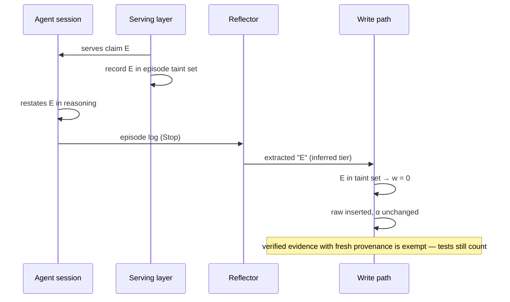
```mermaid
sequenceDiagram
  participant Ag as Agent session
  participant Sv as Serving layer
  participant Rf as Reflector
  participant Wp as Write path
  Sv->>Ag: serves claim E
  Sv->>Sv: record E in episode taint set
  Ag->>Ag: restates E in reasoning
  Ag->>Rf: episode log (Stop)
  Rf->>Wp: extracted "E" (inferred tier)
  Wp->>Wp: E in taint set → w = 0
  Wp->>Wp: raw inserted, α unchanged
  Note over Wp: verified evidence with fresh provenance is exempt — tests still count
```

## 13. Pathway saturation `[gated A15]`

The nth arrival via one pathway saturates; a new pathway lands at nearly full weight. Symmetric on β.

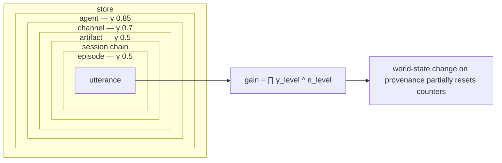
```mermaid
flowchart LR
  subgraph store["store"]
    subgraph agent["agent — γ 0.85"]
      subgraph channel["channel — γ 0.7"]
        subgraph artifact["artifact — γ 0.5"]
          subgraph chain["session chain"]
            subgraph episode["episode — γ 0.5"]
              U["utterance"]
            end
          end
        end
      end
    end
  end
  U --> G["gain = ∏ γ_level ^ n_level"]
  G --> R["world-state change on provenance partially resets counters"]
```

## 14. Retrieval — Mode A gather `[v1]`

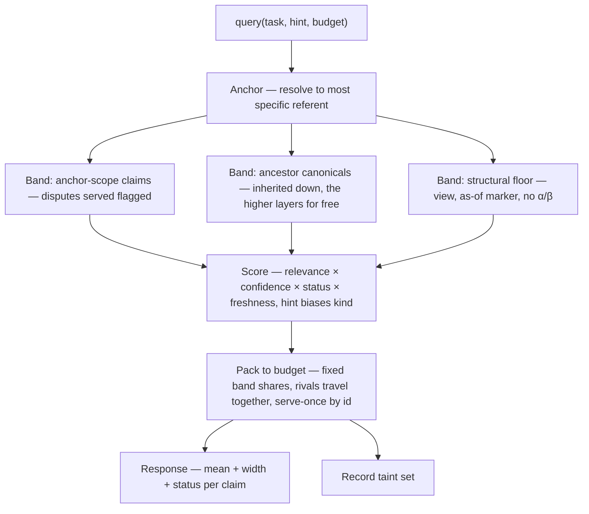
```mermaid
flowchart TD
  Q["query(task, hint, budget)"] --> AN["Anchor — resolve to most specific referent"]
  AN --> B1["Band: anchor-scope claims — disputes served flagged"]
  AN --> B2["Band: ancestor canonicals — inherited down, the higher layers for free"]
  AN --> B3["Band: structural floor — view, as-of marker, no α/β"]
  B1 --> SC["Score — relevance × confidence × status × freshness, hint biases kind"]
  B2 --> SC
  B3 --> SC
  SC --> PK["Pack to budget — fixed band shares, rivals travel together, serve-once by id"]
  PK --> OUT["Response — mean + width + status per claim"]
  PK --> TT["Record taint set"]
```

## 15. Retrieval modes and budget `[v1 / gated]`

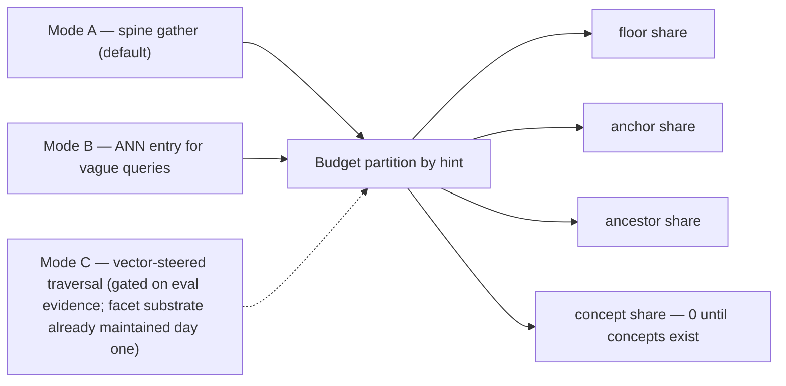
```mermaid
flowchart LR
  A["Mode A — spine gather (default)"] --> BUD["Budget partition by hint"]
  B["Mode B — ANN entry for vague queries"] --> BUD
  C["Mode C — vector-steered traversal (gated on eval evidence; facet substrate already maintained day one)"] -.-> BUD
  BUD --> F["floor share"]
  BUD --> AS["anchor share"]
  BUD --> AC["ancestor share"]
  BUD --> CS["concept share — 0 until concepts exist"]
```

## 16. Transports — one ambient session `[v1]`

Taint follows serving on every transport. Capture is enqueue-only.

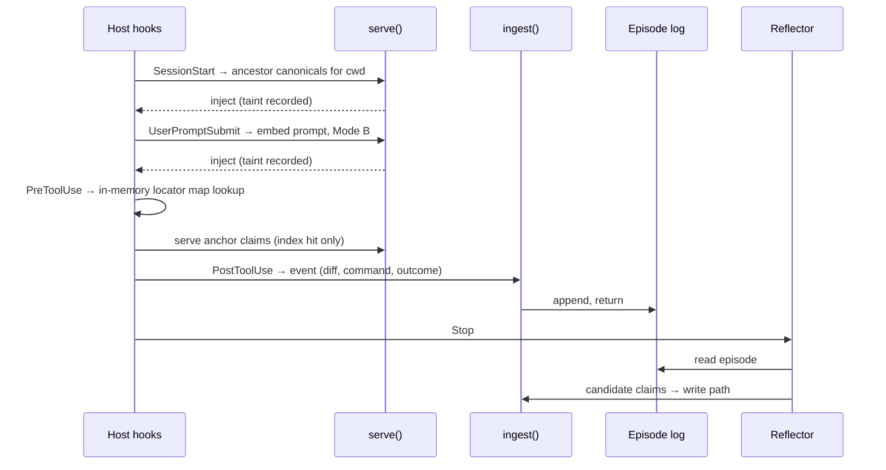
```mermaid
sequenceDiagram
  participant Hk as Host hooks
  participant Sv as serve()
  participant Ig as ingest()
  participant Log as Episode log
  participant Rf as Reflector
  Hk->>Sv: SessionStart → ancestor canonicals for cwd
  Sv-->>Hk: inject (taint recorded)
  Hk->>Sv: UserPromptSubmit → embed prompt, Mode B
  Sv-->>Hk: inject (taint recorded)
  Hk->>Hk: PreToolUse → in-memory locator map lookup
  Hk->>Sv: serve anchor claims (index hit only)
  Hk->>Ig: PostToolUse → event (diff, command, outcome)
  Ig->>Log: append, return
  Hk->>Rf: Stop
  Rf->>Log: read episode
  Rf->>Ig: candidate claims → write path
```

## 17. Three clocks `[v1]`

Every mechanism hangs off exactly one clock.

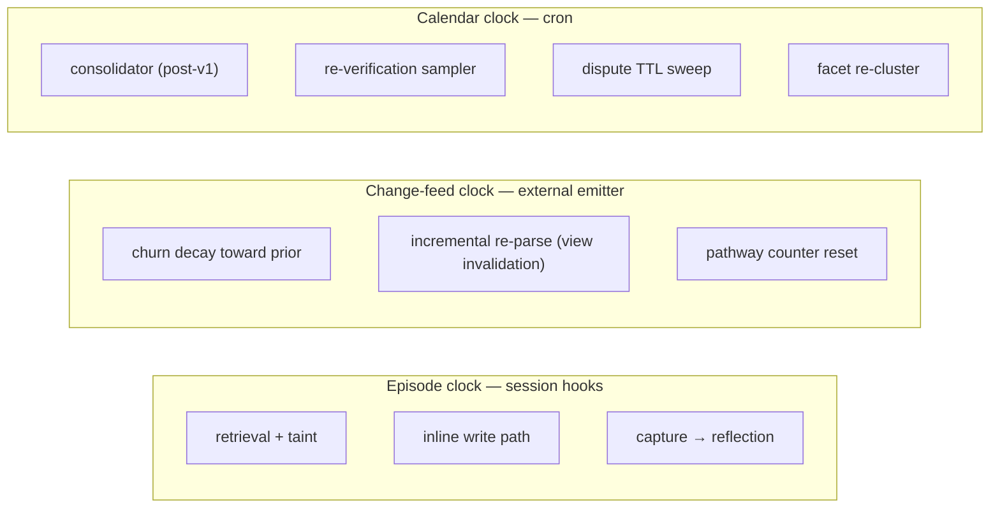
```mermaid
flowchart LR
  subgraph E["Episode clock — session hooks"]
    E1["retrieval + taint"]
    E2["inline write path"]
    E3["capture → reflection"]
  end
  subgraph Cm["Change-feed clock — external emitter"]
    C1["churn decay toward prior"]
    C2["incremental re-parse (view invalidation)"]
    C3["pathway counter reset"]
  end
  subgraph Ca["Calendar clock — cron"]
    A1["consolidator (post-v1)"]
    A2["re-verification sampler"]
    A3["dispute TTL sweep"]
    A4["facet re-cluster"]
  end
```

## 18. Consolidation — accountable merges `[post-v1]`

Merges are claims. Evidence stays member-level. Bad merges split.

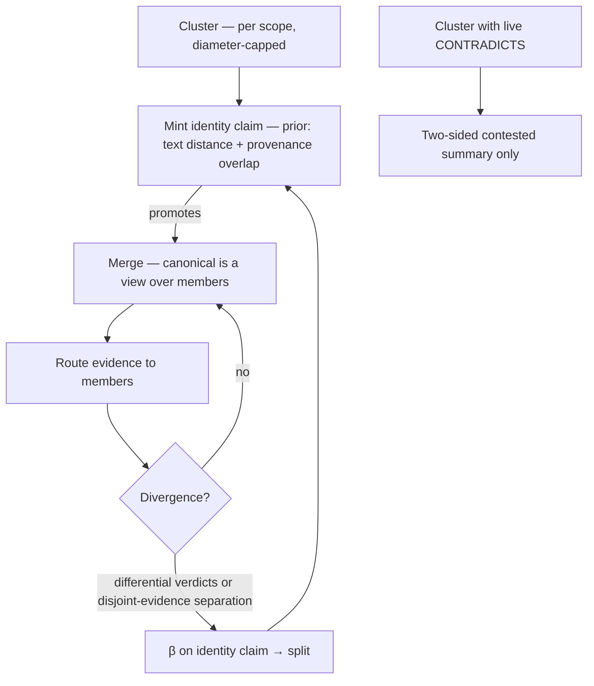
```mermaid
flowchart TD
  CL["Cluster — per scope, diameter-capped"] --> ID["Mint identity claim — prior: text distance + provenance overlap"]
  ID -->|promotes| MG["Merge — canonical is a view over members"]
  MG --> RT["Route evidence to members"]
  RT --> DV{"Divergence?"}
  DV -->|differential verdicts or disjoint-evidence separation| SP["β on identity claim → split"]
  SP --> ID
  DV -->|no| MG
  CT["Cluster with live CONTRADICTS"] --> TS["Two-sided contested summary only"]
```

## 19. Verticals `[post-v1 except containment]`

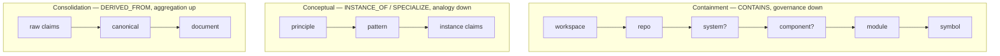
```mermaid
flowchart TB
  subgraph V1["Containment — CONTAINS, governance down"]
    W["workspace"] --> Rp["repo"] --> Sy["system?"] --> Co["component?"] --> Mo["module"] --> Sb["symbol"]
  end
  subgraph V2["Conceptual — INSTANCE_OF / SPECIALIZE, analogy down"]
    P1["principle"] --> Pt["pattern"] --> In["instance claims"]
  end
  subgraph V3["Consolidation — DERIVED_FROM, aggregation up"]
    Rw["raw claims"] --> Cn["canonical"] --> Dc["document"]
  end
```

Levels are pack-declared data and nullable; `?` marks asserted strata (ordinary existence claims).

## 20. Documents `[post-v1]`

Documents hold no evidence; assertions are member claims.

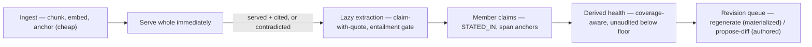
```mermaid
flowchart LR
  Dg["Ingest — chunk, embed, anchor (cheap)"] --> Sv["Serve whole immediately"]
  Sv -->|served + cited, or contradicted| Ex["Lazy extraction — claim-with-quote, entailment gate"]
  Ex --> Mb["Member claims — STATED_IN, span anchors"]
  Mb --> Hl["Derived health — coverage-aware, unaudited below floor"]
  Hl --> Rv["Revision queue — regenerate (materialized) / propose-diff (authored)"]
```

`Dg` and the drain half of `Ex` are prototyped early (E1–E7, no numbered phase — plan §5): chunking, the extraction drain, and a real `AnthropicExtractor` all run today, gated by the byte-exact *verbatim* gate rather than the semantic entailment gate this diagram names. `Sv` and everything from `Mb` on remain unbuilt — nothing serves yet.

## 21. Backfill and onboarding `[post-v1]`

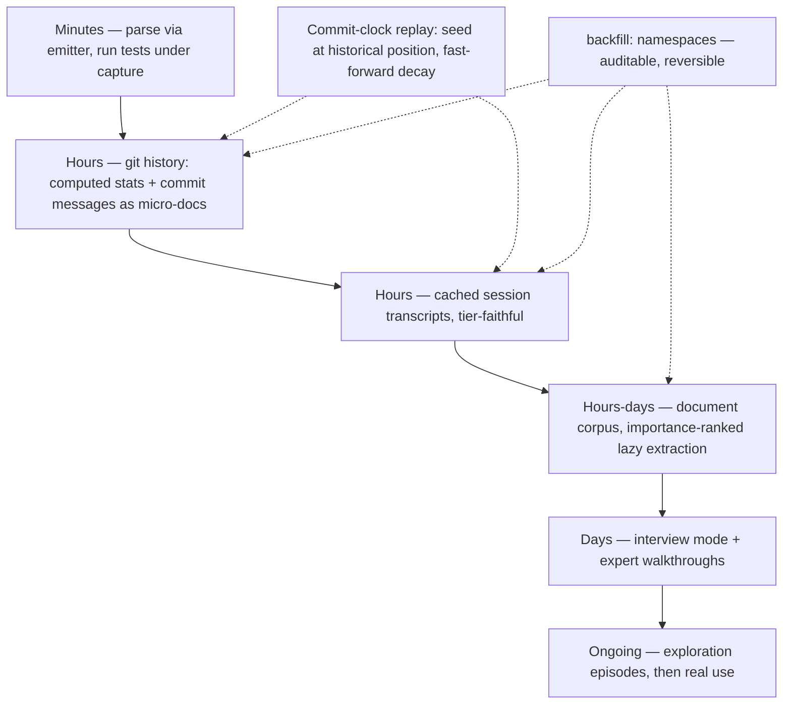
```mermaid
flowchart TD
  P1["Minutes — parse via emitter, run tests under capture"] --> P2["Hours — git history: computed stats + commit messages as micro-docs"]
  P2 --> P3["Hours — cached session transcripts, tier-faithful"]
  P3 --> P4["Hours-days — document corpus, importance-ranked lazy extraction"]
  P4 --> P5["Days — interview mode + expert walkthroughs"]
  P5 --> P6["Ongoing — exploration episodes, then real use"]
  R1["Commit-clock replay: seed at historical position, fast-forward decay"] -.-> P2
  R1 -.-> P3
  NS["backfill:<source> namespaces — auditable, reversible"] -.-> P2
  NS -.-> P3
  NS -.-> P4
```

## 22. Build order `[plan 1.7]`

```mermaid
flowchart LR
  S1["S1 adjudicator accuracy ≥90% — gates P3"]
  S2["S2 embeddings"]
  S3["S3 sqlite-vec + session map build"]
  P0["P0 scaffold + schemas"] --> P1["P1 store"] --> P2["P2 referents + ingest port"] --> P3["P3 write path"] --> P4["P4 retrieval + MCP"] --> P5["P5 harness"] --> P6["P6 hooks"] --> P7["P7 change feed"] --> P8["P8 reflector"]
  S1 -.-> P3
  S2 -.-> P2
  S3 -.-> P2
```

## 23. Failure → guard map

| Failure | Guard | § |
|---|---|---|
| Retrieval echo loop | taint set; inferred restatements at w=0 | 4.3 |
| Confident-and-stale | neighbour-expanded decay; re-verification sampler | 4.5, 9 |
| Search-space poisoning | unconditional dispute on verified contradiction | 5.6 |
| Evidence attractor / shielding | member-level evidence routing | 8.3 |
| Absorbing merges / chain drift | identity claims + divergence splits; diameter caps | 8.2–8.4 |
| Read-side false consensus | rivals travel together | 7.4 |
| Same-pathway inflation | pathway saturation, symmetric on β | 4.7 |
| Stale floor served as truth | view semantics, as-of marker, feed-triggered re-parse | 7.1 |
| Noun soup | provisional referents invisible until corroborated | 5.2 |
| Elective-tool starvation | ambient transports | 7.6 |
| Zombie disputes | TTL auto-deprecate, served flagged | 6.4 |
| Threshold brittleness | full stage logging, offline replay | 5.8, 13 |
